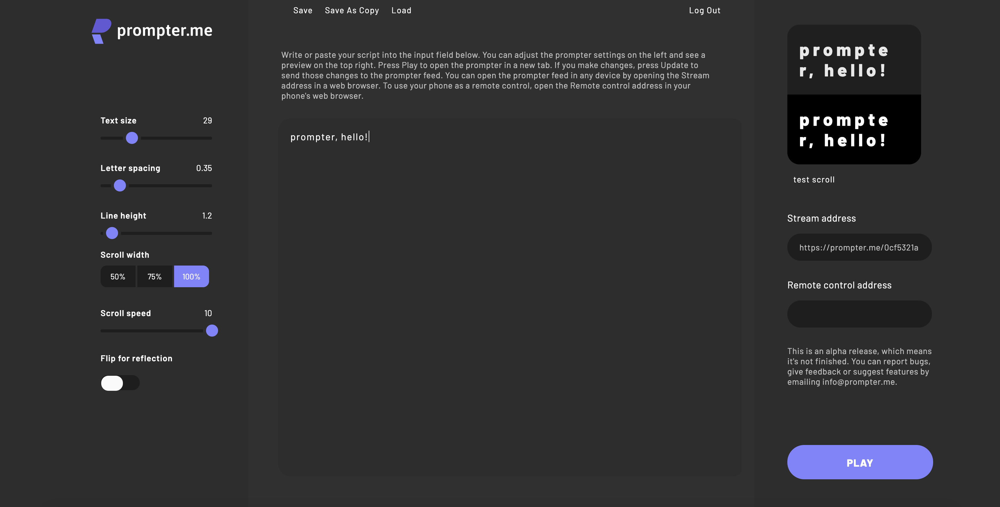

  

  

An opensource teleprompter application for the browser.

# Teleprompter

## What is Prompter.me?

Prompter.me is a _free_, _open source_ teleprompter on the web. Using it doesn't require you to download anything or to sign up for anything. It was made to give content creators an actually useful free teleprompter, which would allow them to use it on their own without any additional apps or hacks. After all, a lot of video content creators out there are one-person operations, and we know using a prompter without help can be a real pain in the tuchus.

## Server

The project's server side repository can be found [here](https://github.com/zilahir/teleprompter-server).

The server is currently deployed to `AWS – Lambda`. You can crate your own instane if you wish to have a _self-hosted_ version of prompter. Or anywhere else if you wish, you need a `node` environment, and a `MongoDB`.

## Contributors

- :nail_care: _design_: Mikko Oitinen 🇫🇮 ([design](https://xd.adobe.com/view/614443a6-af97-49a7-603e-e82e2c667a77-1775/))
- :computer: _dev_: Richard Zilahi [http](https://richardzilahi.hu) 🇭🇺

## Project dependencies

This project heavily depends on the following `open source` projects.

1. [`redux`](https://github.com/reduxjs/redux)
2. [`react-redux`](https://github.com/reduxjs/react-redux)
3. [`redux-thunk`](https://github.com/reduxjs/redux-thunk)
4. [`redux-persist`](https://github.com/rt2zz/redux-persist)
5. [`styled-components`](https://github.com/styled-components)
6. [`use-socket.io-client`](https://github.com/iamgyz/use-socket.io-client)
7. [`uuid`](https://github.com/uuidjs/uuid)
8. [`classnames`](https://github.com/JedWatson/classnames)
9. [`prop-tpyes`](https://github.com/facebook/prop-types)
10. [`hex-to-rgba`](https://github.com/misund/hex-to-rgba)
11. [... and a lot other](https://github.com/zilahir/teleprompter/blob/master/package.json)

## Developing

Contribution is very welcome! You need to clone this, and the [server](https://github.com/zilahir/teleprompter-server) repository.

For the client:

1. `npm i`
2. `npm run start`
3. The client is listening on `:4444`

For the server: 

1. `npm install`
2. `npm run dev`
3. The server is listening on `:5000`

## Misc

This project is deployed via [netlify](https://netlify.com).

Special thanks to [@munkacsimark](https://github.com/munkacsimark/) for helping me out with the scrolling function. :wave:

[This](https://open.spotify.com/track/6ULAF7fV7JPQPPHz1aP3vc?si=M8ieNoCJR6Ob8JatZ8JEAA) is most listened song during the development of [promoter.me](https://http://prompter.me/).

## Licence

This is a _free_ product, and it's licenced under `BSD 3-Clause License`. 